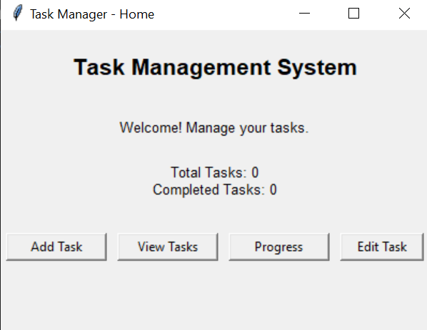
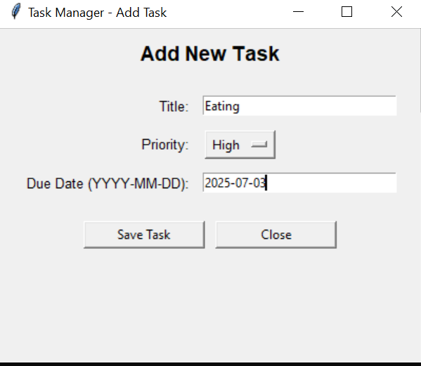
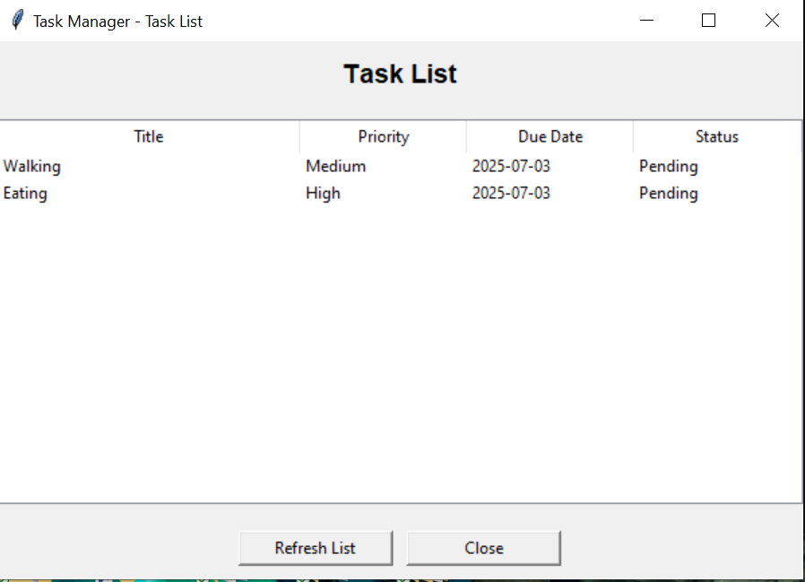
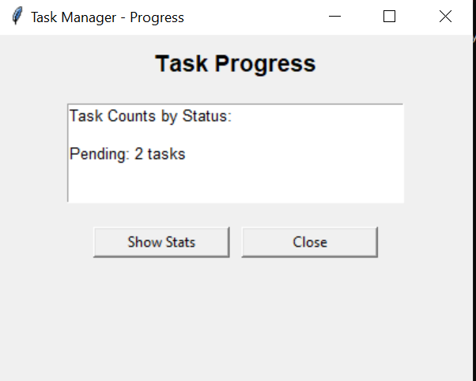

# 💼 Finance Tracker

A simple and effective web-based application to help users manage their personal finances by tracking income, expenses, and savings. The Finance Tracker empowers users with a clean interface, insightful visualizations, and efficient tools to stay on top of their budget.

---

## 📌 Project Description

Finance Tracker is designed to streamline the process of monitoring personal financial activity. Whether you're looking to keep track of everyday spending or manage monthly savings goals, this application provides a reliable platform to log transactions, organize categories, and view analytics in real-time.

---
## Tools and Techology
Frontend- Tkinter
Backend-Python and sqlite

[App Running](images_tk/run.PNG)

## Team Contributions

Sameer(Leader):
Make home interface(home.py)
Asma:
Edit Task (edit_task.py)
Ayesha:
Add Task(add_task.py)
Umair:
Make progress bar of task(progress.py)
Ashfaq:
Make task_list.py

## Pull request Links
https://github.com/SameerHandsome/Finance-tracker/pull/5
https://github.com/SameerHandsome/Finance-tracker/pull/4
https://github.com/SameerHandsome/Finance-tracker/pull/3
https://github.com/SameerHandsome/Finance-tracker/pull/2
https://github.com/SameerHandsome/Finance-tracker/pull/1
