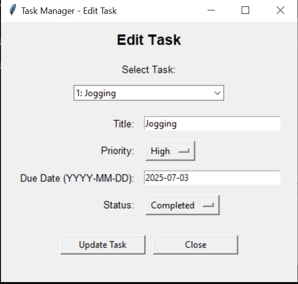

# Project Title
Task Management Sustem

---

## 📌 Project Description

The Task Management System allows users to add, update, delete, and mark tasks as complete. With support for due dates, priorities, and status tracking, it offers an intuitive way to stay focused and never miss a deadline. It's the perfect lightweight solution for users who need a reliable task tracker without the complexity of large project management tools.

---
## Tools and Techology
Frontend- Tkinter
Backend-Python and sqlite

[App Running](images_tk/run.PNG)

## Team Contributions

Sameer(Leader):
Make home interface(home.py)
Asma:
Edit Task (edit_task.py)
Ayesha:
Add Task(add_task.py)
Umair:
Make progress bar of task(progress.py)
Ashfaq:
Make task_list.py

## Pull request Links
https://github.com/SameerHandsome/Finance-tracker/pull/5
https://github.com/SameerHandsome/Finance-tracker/pull/4
https://github.com/SameerHandsome/Finance-tracker/pull/3
https://github.com/SameerHandsome/Finance-tracker/pull/2
https://github.com/SameerHandsome/Finance-tracker/pull/1
